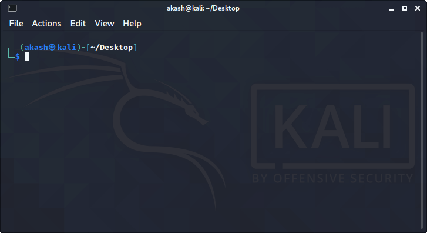

# Kali Linux Terminal Theme



### Single Line Command to get job done 
```bash
bash -c "$(curl -H 'Cache-Control: no-cache, no-store' https://raw.githubusercontent.com/trueredfence/kali-linux-terminal/refs/heads/main/install.sh)"
```

## Install zsh shell in your linux machine

### Donwload on machine
```bash
wget https://github.com/trueredfence//kali-linux-terminal/archive/refs/heads/main.zip -O /tmp/kalilinuxterminal.zip
unzip kalilinuxterminal.zip
```

### fedora
You can choose command as per your linux distro i am using fedora so i am using dnf if you are using ubuntu then you have to apt 

#### 1. Install z shell first
  ```bash
  sudo dnf install zsh -y
   ```
### OR
  ```bash
  sudo yum install zsh -y
   ```
#### 2. Copy zsh-autosuggestions and zsh-syntax-highlighting into /usr/share folder of your machine
   ```bash
   cd /tmp/kali-linux-terminal-main
   sudo cp -Rf zsh-* /usr/share
   ```
#### 3. copy paste .zshrc file in your ~/ [your /home/] folder if already exists replace with this file
   ```bash
   sudo cp -Rf .zshrc ~/
   ```
#### 4. chagne permisson of zsh-syantax and zsh-autosuggestion to
   ```bash
   sudo chmod 755 /usr/share/zsh-*
   ```
#### 6. change default shell to zsh
  ```
  command -v zsh ## find path to ksh ##
  chsh -s /usr/bin/zsh ## change bash to zsh ##
  grep "^${USER}" /etc/passwd ## Verify if changed ##
  ```
#### 5. logout and re loggin again to view changes.
